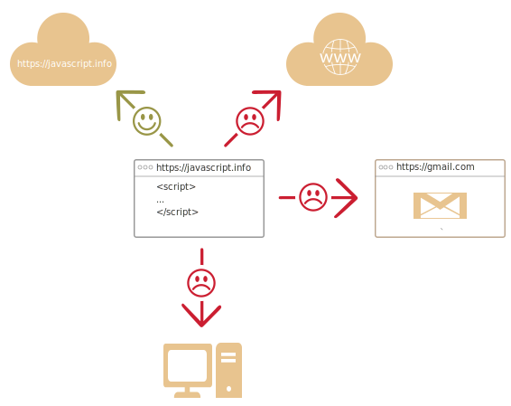

# Una Introducción para JavaScript

Veamos que es tan especial acerca de JavaScript, que podemo lograr con el y qué otras tecnologías juegan bien con el.

## ¿Qué es JavaScript?

*JavaScript* fue creado inicialmente para *"hacer que las páginas web tengan vida"*.

Los programas en este lenguaje son llamados *scripts*. Estos pueden ser escritos en la mismas páginas HTML y correr automáticamente cuando la página carga.

Los Scripts son provistos y ejecutados como texto plano. Ellos no necesitan de ninguna preparación especial o compilar para correr.

En este aspecto, JavaScript es muy diferente a otro lenguaje llamado [Java](https://en.wikipedia.org/wiki/Java_(programming_language)).

```smart header="¿Por qué es llamado <u>Java</u>Script?"
Cuando JavaScript fue creado, inicialmente tuvo otro nombre: "LiveScript". Pero Java era muy popular en esos tiempos, así que se pensó que posicionándolo como el "hermano menor" de Java podría ayudarlo.

Pero a medida que fue evolucionando, JavaScript se convirtió en un lenguaje completamente independiente con sus propias especificaciones llamadas [ECMAScript](http://en.wikipedia.org/wiki/ECMAScript), y ahora no tiene ningún tipo de relación con Java.
```

Hoy en día, JavaScript puede ser ejecutado no solo en un explorador, sino que también en servidores, e incluso en cualquier dispositivo que tenga un programa especial llamado [the JavaScript engine](https://en.wikipedia.org/wiki/JavaScript_engine) (El motor JavaScript).

El explorador posee un motor incrustado a veces llamado "JavaScript virtual machine" (Máquina virtual JavaScript).

Cada motor posee un "Nombre Código" diferente. Por ejemplo:

- [V8](https://en.wikipedia.org/wiki/V8_(JavaScript_engine)) -- en Chrome y Opera.
- [SpiderMonkey](https://en.wikipedia.org/wiki/SpiderMonkey) -- en Firefox.
- ...Existen otros Nombres Código como "Trident" y "Chakra" para diferentes versiones de IE (Internet Explorer), "ChakraCore" para Microsoft Edge, "Nitro" y "SquirrelFish" para Safari, entre otros.

Es bueno recordar los términos anteriores porque son utilizados en artículos de desarrolladores en internet. Vamos a usarlos también. Como instancia, si "una funcionalidad X es soportada por V8", entonces es probable que funcione en Chrome y Opera.

```smart header="¿Cómo funcionan los motores?"

Los motores son complicados. Pero lo básico es sencillo.

1. El motor (incrustado si es en un browser) lee ("parséa") el script.
2. Luego este convierte ("compila") el script a lenguaje de máquina.
3. Y luego la máquina corre el código, de forma rápida.

El motor aplica optimizaciones en cada paso del proceso. Este incluso observa el script compilado mientras corre, analiza la data que fluye a través de el, y luego optimiza el código de máquina basado en ese conocimiento.
```

## ¿Qué puede hacer JavaScript dentro-del-explorador?

El JavaScript Moderno es un lenguaje de programación "seguro". Este lenguaje no provee acceso de bajo nivel a la memoria y el procesador, porque fue creado inicialmente para exploradores que no lo requieren.

Las capacidades de JavaScript dependen en gran manera del ambiente donde se ejecute. Para instancias, [Node.js](https://wikipedia.org/wiki/Node.js) soporta funciones que permiten a JavaScript el leer o escribir archivos arbitrarios, ejecutar solicitudes de red, entre otros.

JavaScript dentro-del-explorador puede hacer cualquier cosa relacionada a la manipulación de páginas web, interacción con el usuario y con el servidor web.

Para instancias, JavaScript dentro-del-explorador se encuentra disponible para:

- Añadir nuevo código HTML a la página, cambiar contenido existente, modificar estilos.
- Reaccionar a acciones del usuario, acciones del mouse, movimientos del puntero, presión de teclas.
- Enviar solicitudes a través de la red a servidores remotos, descargar y subir archivos (llamados de forma común tecnologías [AJAX](https://en.wikipedia.org/wiki/Ajax_(programming)) and [COMET](https://en.wikipedia.org/wiki/Comet_(programming))).
- Obtener y colocar cookies, realizar preguntas al visitante, mostrar mensajes.
- Guardar datos del lado del cliente ("local storage").

## ¿Qué NO puede hacer JavaScript dentro-del-explorador?

Las habilidades de JavaScript en el buscador son limitadas for el bien y la seguridad del usuario. El objetivo es el prevenir que una página maligna accese a información privada o perjudique la información del usuario.

Ejemplos de estos tipos de restricciones son:

- El código JavaScript ejecutado en una página web no puede leer o escribir de forma arbitraria en archivos del disco duro, copiarlos o ejecutar programas. Por defecto no posee acceso directo a las funcionalidades del Sistema Operativo (OS).

    Los exploradores modernos permiten trabajar con archivos, pero el acceso es limitado a solo ser provisto si el usuario realiza ciertas acciones, como "dejar caer" un archivo en el explorador o seleccionarlo directamente de un campo `<input>`.

    Existen formas de interactuar con la cámara y micrófono y otros dispositivos, pero se requiere los permisos explícitos del usuario. Así que una página con JavaScript habilitado no puede habilitar de forma furtiva la cámara web, escuchar a su alrededor y enviar información a la [NSA](https://en.wikipedia.org/wiki/National_Security_Agency).
- Los Tabs y/o Ventanas generalmente no se conocen entre ellas. Algunas veces si lo hace, si por ejemplo una ventana usó JavaScript para abrir la nueva. Pero incluso en este caso, JavaScript en una de las página no puede acceder al contenido de la otra si poseen portales diferentes (de diferente dominio, protocolo o puerto).

    Esto se llama "Same Origin Policy" o "Política de Origen Idéntico". Para trabajar alrededor de esto, *ambas páginas* deben aceptar el intercambio de datos y contener un código JavaScript especial que lo maneje. Esto será cubierto en el tutorial.

    Esta limitación, enfatizamos, es para la seguridad del usuario.  Una página de `http://cualquier-sitio.com` que un usuario ha abierto, no debe permitir acceder otro tab del explorador web con el URL `http://gmail.com` y robar información de ahí.
- JavaScript puede comunicarse fácilmente sobre la red al servidor desde donde se encuentra la página actual. Pero la habilidad de recibir datos desde otros sitios y/o dominios es limitada. Aunque posible, requiere de un acuerdo explícito (expresado en los headers HTTP) desde el lado del servidor. Repetimos, esta es una limitación segura.



Estos límites no existen si JavaScript es utilizado fuera de un explorador, por ejemplo en un servidor. Los exploradores modernos también disponen de plugins o extensiones que pueden solicitar por permisos extendidos.

## What makes JavaScript unique?

There are at least *three* great things about JavaScript:

```compare
+ Full integration with HTML/CSS.
+ Simple things are done simply.
+ Support by all major browsers and enabled by default.
```
JavaScript is the only browser technology that combines these three things.

That's what makes JavaScript unique. That's why it's the most widespread tool for creating browser interfaces.

That said, JavaScript also allows to create servers, mobile applications, etc.

## Languages "over" JavaScript

The syntax of JavaScript does not suit everyone's needs. Different people want different features.

That's to be expected, because projects and requirements are different for everyone.

So recently a plethora of new languages appeared, which are *transpiled* (converted) to JavaScript before they run in the browser.

Modern tools make the transpilation very fast and transparent, actually allowing developers to code in another language and auto-converting it "under the hood".

Examples of such languages:

- [CoffeeScript](http://coffeescript.org/) is a "syntactic sugar" for JavaScript. It introduces shorter syntax, allowing us to write clearer and more precise code. Usually, Ruby devs like it.
- [TypeScript](http://www.typescriptlang.org/) is concentrated on adding "strict data typing" to simplify the development and support of complex systems. It is developed by Microsoft.
- [Flow](http://flow.org/) also adds data typing, but in a different way. Developed by Facebook.
- [Dart](https://www.dartlang.org/) is a standalone language that has its own engine that runs in non-browser environments (like mobile apps), but also can be transpiled to JavaScript. Developed by Google.

There are more. Of course, even if we use one of transpiled languages, we should also know JavaScript to really understand what we're doing.

## Summary

- JavaScript was initially created as a browser-only language, but is now used in many other environments as well.
- Today, JavaScript has a unique position as the most widely-adopted browser language with full integration with HTML/CSS.
- There are many languages that get "transpiled" to JavaScript and provide certain features. It is recommended to take a look at them, at least briefly, after mastering JavaScript.
